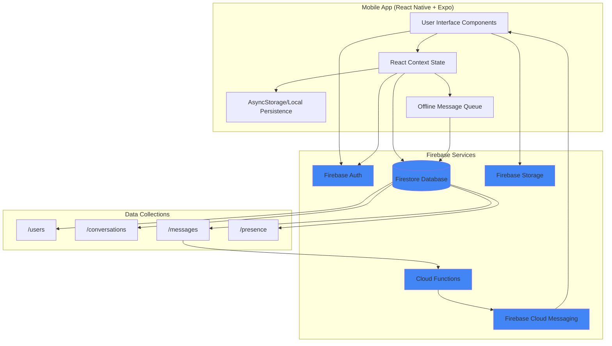
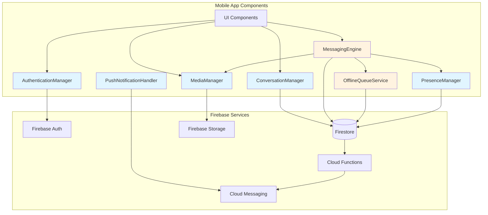
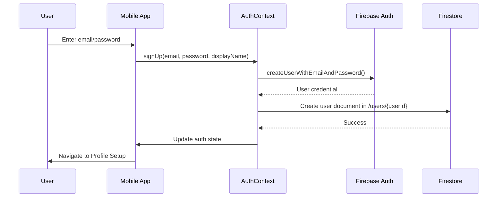
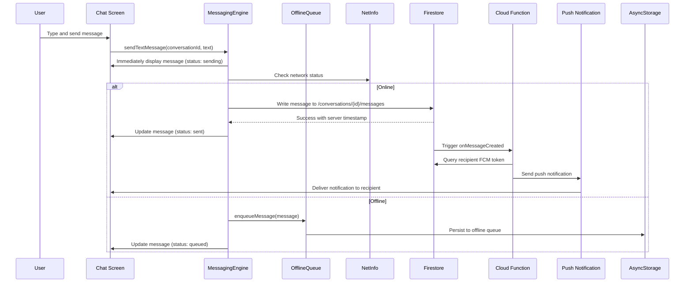
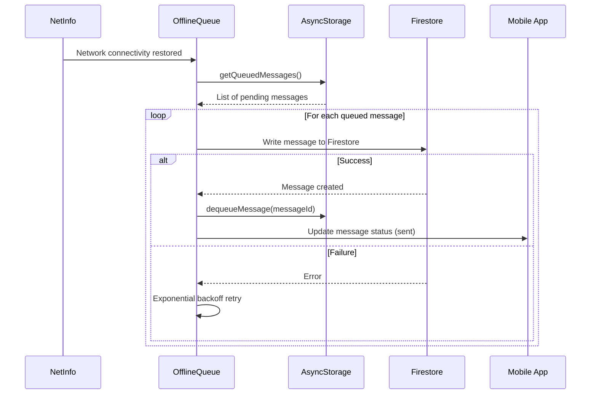
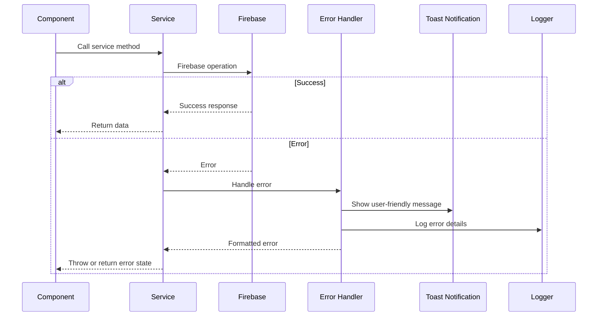

# MessageAI Fullstack Architecture Document

## Introduction

This document outlines the complete architecture for **MessageAI**, a production-quality mobile messaging application with real-time sync, offline support, and WhatsApp-level reliability. The architecture covers the React Native mobile application, Firebase serverless backend, and their integration patterns.

This unified architecture combines mobile frontend concerns (React Native, state management, offline persistence) with serverless backend design (Firebase services, Cloud Functions, real-time sync), ensuring consistency across the technology stack for AI-driven development.

### Starter Template or Existing Project

**N/A - Greenfield Project**

This is a new React Native + Firebase messaging application built from scratch. No starter templates are being used, though we'll leverage standard React Native with Expo managed workflow for rapid development.

### Change Log

| Date | Version | Description | Author |
|------|---------|-------------|--------|
| 2025-10-20 | 1.0 | Initial architecture document | Winston (Architect) |

## High Level Architecture

### Technical Summary

MessageAI is a mobile-first messaging platform built on React Native with Expo and Firebase Backend-as-a-Service. The architecture employs a serverless pattern where the mobile app communicates directly with Firebase services (Firestore, Auth, Storage, FCM) for all backend operations, eliminating the need for custom API servers. Real-time message synchronization is achieved through Firestore's native listeners, while offline capabilities are implemented via local persistence with AsyncStorage and an optimistic UI pattern with message queueing. Cloud Functions are used minimally for push notifications only. This architecture prioritizes rapid MVP development, automatic scaling via Firebase, and WhatsApp-level reliability through proven Firebase infrastructure combined with carefully designed offline-first mobile patterns.

### Platform and Infrastructure Choice

**Platform:** Firebase (Google Cloud Platform)

**Key Services:**
- Firestore (real-time NoSQL database)
- Firebase Authentication (user auth with email/password)
- Firebase Storage (image storage)
- Firebase Cloud Functions (serverless push notification triggers)
- Firebase Cloud Messaging (FCM for push notifications)
- Firebase Hosting (future web version deployment)

**Mobile Platform:** React Native with Expo (iOS for MVP, Android-ready architecture)

**Deployment Host and Regions:**
- Firebase: Multi-region (us-central1 for Cloud Functions, automatic global distribution for Firestore/Storage)
- Expo: Development builds via Expo Go, future production via EAS Build

### Repository Structure

**Structure:** Monorepo

**Monorepo Tool:** npm workspaces (lightweight, no additional tooling needed)

**Package Organization:**
```
/mobile          - React Native app (Expo managed workflow)
/functions       - Firebase Cloud Functions (TypeScript)
/shared          - Shared TypeScript types and constants
```

**Rationale:** Monorepo enables shared TypeScript interfaces between mobile app and Cloud Functions, atomic commits for features spanning client and backend, and simplified developer workflow. npm workspaces chosen over Turborepo/Nx for simplicity given small project scope.

### High Level Architecture Diagram



### Architectural Patterns

- **Serverless Backend-as-a-Service (BaaS):** Firebase provides all backend infrastructure without custom servers - _Rationale:_ Eliminates infrastructure management, automatic scaling, and built-in real-time sync capabilities perfect for messaging apps.

- **Direct Client-to-Firebase Integration:** Mobile app communicates directly with Firebase services via SDK - _Rationale:_ Reduces latency, simplifies architecture, leverages Firebase's optimized client libraries for offline support.

- **Offline-First Mobile Architecture:** Local persistence with optimistic UI updates and background sync - _Rationale:_ Critical for messaging reliability per PRD requirements (FR10, FR12, FR13, FR14).

- **Real-Time Data Synchronization:** Firestore listeners (`onSnapshot`) for live message updates - _Rationale:_ Provides WhatsApp-level instant messaging experience without polling or custom WebSocket infrastructure.

- **Component-Based UI (React Native):** Reusable functional components with React hooks - _Rationale:_ Modern React patterns, excellent developer experience, strong TypeScript support.

- **Repository Pattern for Offline Queue:** Abstract message queue management behind service layer - _Rationale:_ Encapsulates complex retry logic, enables testing, isolates Firebase dependencies.

- **Event-Driven Push Notifications:** Cloud Functions trigger on Firestore document creation - _Rationale:_ Decouples notification logic from mobile app, leverages Firebase's automatic function invocation.

## Tech Stack

### Technology Stack Table

| Category | Technology | Version | Purpose | Rationale |
|----------|-----------|---------|---------|-----------|
| **Mobile Language** | TypeScript | 5.3+ | Type-safe mobile app development | Catches errors at compile time, excellent IDE support, required for shared types |
| **Mobile Framework** | React Native | 0.73.6 | Cross-platform mobile UI framework | iOS + Android from single codebase, large ecosystem, mature Firebase integration |
| **Mobile Runtime** | Expo SDK | 50 | Managed React Native workflow | Simplifies development, OTA updates, easy native module integration, faster iteration |
| **UI Component Library** | React Native Paper | 5.x | Material Design components | Per PRD requirement, WCAG AA support, well-maintained, works seamlessly with Expo |
| **State Management** | React Context API | Built-in | Global state (auth, messages, network) | Per PRD requirement, no external deps, sufficient for MVP scope, easy to test |
| **Navigation** | React Navigation | 6.x | Screen navigation and routing | Industry standard for RN, TypeScript support, deep linking ready |
| **Backend Language** | TypeScript | 5.3+ | Cloud Functions development | Type safety, shared types with mobile app, excellent Firebase SDK support |
| **Backend Framework** | Firebase Cloud Functions | Gen 2 | Serverless functions (push notifications) | Event-driven, auto-scaling, integrated with Firebase ecosystem |
| **API Style** | Direct Firebase SDK | N/A | No REST/GraphQL layer | Firebase SDK provides optimized real-time queries, eliminates custom API server |
| **Database** | Cloud Firestore | Latest | Real-time NoSQL document database | Built-in offline support, real-time listeners, automatic scaling, optimistic locking |
| **Cache** | AsyncStorage | @react-native-async-storage/async-storage 1.x | Local message persistence | Simple key-value store, sufficient for message cache and offline queue |
| **File Storage** | Firebase Storage | Latest | Image upload and hosting | Integrated with Firebase Auth, CDN-backed, client-side upload support |
| **Authentication** | Firebase Authentication | Latest | User auth (email/password) | Per PRD requirement, built-in security, session management, easy integration |
| **Mobile Testing** | Jest + React Native Testing Library | Jest 29.x, RNTL 12.x | Unit and integration tests | Standard React Native testing stack, component testing, mocking support |
| **Backend Testing** | Jest + Firebase Emulator | Jest 29.x | Cloud Functions unit tests | Local testing without Firebase calls, fast test execution |
| **E2E Testing** | Detox | 20.x | End-to-end mobile testing | Deferred to post-MVP per PRD, noted for future |
| **Build Tool** | Expo CLI | 0.17+ | Mobile app build and deployment | Manages native builds, OTA updates, EAS Build integration |
| **Bundler** | Metro | Built-in with RN | JavaScript bundling for React Native | Default RN bundler, optimized for mobile |
| **IaC Tool** | Firebase CLI | 13.x | Infrastructure deployment | Deploys Functions, Firestore rules, Storage rules via command line |
| **CI/CD** | GitHub Actions | N/A | Deferred to post-MVP | Manual deployment acceptable for MVP timeline |
| **Monitoring** | Firebase Crashlytics | Latest | Deferred to post-MVP | Per PRD analytics decision, crash reporting added later |
| **Logging** | console + Firebase Functions Logs | Built-in | Basic logging via console, Functions logs in GCP | Sufficient for MVP, structured logging deferred |
| **CSS Framework** | Styled Components | 6.x | Component styling | CSS-in-JS for RN, theme support, dynamic styling |
| **Image Handling** | expo-image-picker | ~14.x | Camera/gallery access | Per PRD image upload requirement, built-in compression |
| **Push Notifications** | expo-notifications + FCM | ~0.27.x | Foreground notifications | Per PRD FR11, Expo wrapper around native APIs |
| **Network State** | @react-native-community/netinfo | 11.x | Detect online/offline status | Required for offline queue (Story 2.3), reliable connection detection |
| **Form Validation** | React Hook Form | 7.x | Input validation (auth, profile) | Lightweight, TypeScript support, integrates with React Native Paper |

## Data Models

### User

**Purpose:** Represents a registered user with authentication and profile information. Central entity for auth, presence, and message attribution.

**Key Attributes:**
- `id`: string - Firebase Auth UID (primary key)
- `email`: string - User's email address
- `displayName`: string - User's chosen display name (2-50 chars)
- `photoURL`: string | null - Firebase Storage URL for profile picture
- `createdAt`: Timestamp - Account creation timestamp
- `updatedAt`: Timestamp - Last profile update

#### TypeScript Interface

```typescript
export interface User {
  id: string;
  email: string;
  displayName: string;
  photoURL: string | null;
  createdAt: Date;
  updatedAt: Date;
}
```

#### Relationships

- One User has many Conversations (via participants array)
- One User has many Messages (as sender)
- One User has one Presence status

### Conversation

**Purpose:** Represents a chat conversation (one-on-one or group). Container for messages and participant metadata.

**Key Attributes:**
- `id`: string - Auto-generated Firestore document ID
- `type`: 'oneOnOne' | 'group' - Conversation type
- `participants`: string[] - Array of user IDs
- `name`: string | null - Group name (null for one-on-one)
- `photoURL`: string | null - Group photo URL (null for one-on-one)
- `createdBy`: string - User ID of creator
- `createdAt`: Timestamp - Conversation creation time
- `lastMessage`: string | null - Preview of last message text
- `lastMessageAt`: Timestamp | null - Timestamp of last message
- `lastMessageType`: 'text' | 'image' | null - Type of last message

#### TypeScript Interface

```typescript
export type ConversationType = 'oneOnOne' | 'group';

export interface Conversation {
  id: string;
  type: ConversationType;
  participants: string[];
  name: string | null;
  photoURL: string | null;
  createdBy: string;
  createdAt: Date;
  lastMessage: string | null;
  lastMessageAt: Date | null;
  lastMessageType: 'text' | 'image' | null;
}
```

#### Relationships

- One Conversation has many Messages (subcollection)
- One Conversation has many TypingStatus entries (subcollection)
- One Conversation belongs to many Users (many-to-many via participants)

### Message

**Purpose:** Individual message within a conversation. Supports text and image messages with delivery tracking.

**Key Attributes:**
- `id`: string - Auto-generated Firestore document ID
- `conversationId`: string - Parent conversation ID
- `type`: 'text' | 'image' - Message content type
- `text`: string | null - Message text (null for image-only)
- `imageURL`: string | null - Firebase Storage URL for image
- `imageWidth`: number | null - Original image width in pixels
- `imageHeight`: number | null - Original image height in pixels
- `senderId`: string - User ID of sender
- `timestamp`: Timestamp - Server timestamp when message created
- `status`: 'sending' | 'sent' | 'delivered' | 'read' - Delivery status
- `readBy`: string[] - Array of user IDs who read the message (for groups)

#### TypeScript Interface

```typescript
export type MessageType = 'text' | 'image';
export type MessageStatus = 'sending' | 'sent' | 'delivered' | 'read';

export interface Message {
  id: string;
  conversationId: string;
  type: MessageType;
  text: string | null;
  imageURL: string | null;
  imageWidth: number | null;
  imageHeight: number | null;
  senderId: string;
  timestamp: Date;
  status: MessageStatus;
  readBy: string[];
}
```

#### Relationships

- One Message belongs to one Conversation
- One Message belongs to one User (sender)

### Presence

**Purpose:** Tracks user online/offline status and last seen timestamp for presence indicators.

**Key Attributes:**
- `userId`: string - User ID (document ID)
- `state`: 'online' | 'offline' - Current connection state
- `lastSeen`: Timestamp - Last time user was active
- `updatedAt`: Timestamp - Last status update time

#### TypeScript Interface

```typescript
export type PresenceState = 'online' | 'offline';

export interface Presence {
  userId: string;
  state: PresenceState;
  lastSeen: Date;
  updatedAt: Date;
}
```

#### Relationships

- One Presence belongs to one User (one-to-one)

### TypingStatus

**Purpose:** Ephemeral typing indicator status within a conversation. Auto-expires after 3 seconds.

**Key Attributes:**
- `userId`: string - User ID who is typing
- `conversationId`: string - Conversation ID
- `isTyping`: boolean - Whether user is currently typing
- `timestamp`: Timestamp - When typing status was last updated (for TTL)

#### TypeScript Interface

```typescript
export interface TypingStatus {
  userId: string;
  conversationId: string;
  isTyping: boolean;
  timestamp: Date;
}
```

#### Relationships

- One TypingStatus belongs to one Conversation
- One TypingStatus belongs to one User

## API Specification

**N/A - Direct Firebase SDK Integration**

MessageAI uses Firebase SDK directly from the mobile app, eliminating the need for a custom REST or GraphQL API layer. All data operations use Firestore queries, Firebase Auth methods, and Firebase Storage uploads via the official Firebase JavaScript SDK.

**Firebase SDK "API" Patterns:**
- Authentication: `createUserWithEmailAndPassword()`, `signInWithEmailAndPassword()`
- Firestore Queries: `collection().where().onSnapshot()` for real-time data
- Storage Uploads: `ref().put()` for image uploads
- Cloud Functions: Called automatically via Firestore triggers (no client API)

## Components

### AuthenticationManager

**Responsibility:** Manages user authentication state, login/signup flows, and auth persistence using Firebase Auth.

**Key Interfaces:**
- `signUp(email, password, displayName)` - Create new user account
- `signIn(email, password)` - Authenticate existing user
- `signOut()` - End user session
- `getCurrentUser()` - Get current auth state
- `onAuthStateChanged(callback)` - Listen to auth changes

**Dependencies:** Firebase Auth SDK, AsyncStorage (token persistence)

**Technology Stack:** Firebase Authentication, React Context (AuthContext)

### ConversationManager

**Responsibility:** Handles conversation list queries, conversation creation (one-on-one and groups), and real-time conversation updates.

**Key Interfaces:**
- `getUserConversations(userId)` - Query user's conversations with real-time listener
- `createOneOnOneConversation(userId, otherUserId)` - Create or get existing one-on-one chat
- `createGroupConversation(name, participantIds, photoURL?)` - Create group chat
- `updateLastMessage(conversationId, message)` - Update conversation metadata

**Dependencies:** Firestore SDK, ConversationModel

**Technology Stack:** Firestore queries with `onSnapshot`, React Context (ConversationsContext)

### MessagingEngine

**Responsibility:** Core messaging functionality including sending/receiving messages, optimistic UI updates, offline queue management, and delivery state tracking.

**Key Interfaces:**
- `sendTextMessage(conversationId, text)` - Send text message with optimistic UI
- `sendImageMessage(conversationId, imageUri)` - Upload and send image message
- `getMessages(conversationId)` - Query messages with real-time listener
- `updateMessageStatus(messageId, status)` - Update delivery/read status
- `processOfflineQueue()` - Send queued messages when online

**Dependencies:** Firestore SDK, Firebase Storage, AsyncStorage (offline queue), NetworkManager

**Technology Stack:** Firestore subcollections, optimistic updates pattern, message queue service

### OfflineQueueService

**Responsibility:** Manages offline message queue, retry logic with exponential backoff, and background sync when connectivity returns.

**Key Interfaces:**
- `enqueueMessage(message)` - Add message to offline queue
- `dequeueMessage(messageId)` - Remove from queue after successful send
- `processQueue()` - Attempt to send all queued messages
- `getQueuedMessages()` - Get list of pending messages

**Dependencies:** AsyncStorage, NetworkManager, Firestore SDK

**Technology Stack:** AsyncStorage for queue persistence, NetInfo for connectivity detection

### PresenceManager

**Responsibility:** Tracks and updates user online/offline status, manages presence listeners, and provides "last seen" functionality.

**Key Interfaces:**
- `setUserOnline(userId)` - Mark user as online
- `setUserOffline(userId)` - Mark user as offline with lastSeen timestamp
- `getUserPresence(userId)` - Get user's current presence with real-time listener
- `setupPresenceListeners()` - Configure Firebase disconnect handlers

**Dependencies:** Firestore SDK, Firebase Database (for onDisconnect triggers)

**Technology Stack:** Firestore documents with `onDisconnect()` handlers

### MediaManager

**Responsibility:** Handles image selection, compression, upload to Firebase Storage, and download/caching for display.

**Key Interfaces:**
- `pickImage(source: 'camera' | 'gallery')` - Select image from device
- `compressImage(imageUri, maxWidth)` - Client-side image compression
- `uploadImage(imageUri, path)` - Upload to Firebase Storage with progress
- `downloadImage(url)` - Download and cache image locally

**Dependencies:** expo-image-picker, Firebase Storage, AsyncStorage (image cache)

**Technology Stack:** Expo ImagePicker, Firebase Storage SDK, image compression library

### PushNotificationHandler

**Responsibility:** Manages FCM token registration, notification permissions, and foreground notification display.

**Key Interfaces:**
- `registerForNotifications()` - Request permissions and get FCM token
- `saveFCMToken(userId, token)` - Save token to Firestore for Cloud Function targeting
- `handleForegroundNotification(notification)` - Display in-app notification banner
- `navigateToConversation(notificationData)` - Handle notification tap navigation

**Dependencies:** expo-notifications, FCM, Firestore SDK

**Technology Stack:** Expo Notifications API, Firebase Cloud Messaging

### Component Diagram



## Core Workflows

### User Authentication Flow



### Send Message Workflow (with Optimistic UI)



### Offline Message Queue Processing



## Database Schema

### Firestore Collections Structure

```
/users/{userId}
  - id: string
  - email: string
  - displayName: string
  - photoURL: string | null
  - createdAt: timestamp
  - updatedAt: timestamp
  - fcmToken: string (for push notifications)

/conversations/{conversationId}
  - id: string
  - type: 'oneOnOne' | 'group'
  - participants: string[]  [INDEXED]
  - name: string | null
  - photoURL: string | null
  - createdBy: string
  - createdAt: timestamp
  - lastMessage: string | null
  - lastMessageAt: timestamp | null  [INDEXED for sorting]
  - lastMessageType: 'text' | 'image' | null

  /messages/{messageId}  [SUBCOLLECTION]
    - id: string
    - conversationId: string
    - type: 'text' | 'image'
    - text: string | null
    - imageURL: string | null
    - imageWidth: number | null
    - imageHeight: number | null
    - senderId: string
    - timestamp: timestamp  [INDEXED for ordering]
    - status: 'sending' | 'sent' | 'delivered' | 'read'
    - readBy: string[]

  /typing/{userId}  [SUBCOLLECTION - ephemeral, TTL 3 seconds]
    - userId: string
    - isTyping: boolean
    - timestamp: timestamp

/presence/{userId}
  - userId: string
  - state: 'online' | 'offline'
  - lastSeen: timestamp
  - updatedAt: timestamp
```

### Firestore Indexes

**Composite Indexes Required:**

1. **User Conversations Query**
   - Collection: `conversations`
   - Fields: `participants` (ARRAY_CONTAINS), `lastMessageAt` (DESCENDING)
   - Purpose: Get user's conversations sorted by recent activity

2. **Conversation Messages Query**
   - Collection: `conversations/{conversationId}/messages`
   - Fields: `timestamp` (ASCENDING)
   - Purpose: Get messages in chronological order
   - Note: Single-field index, auto-created by Firestore

### Firestore Security Rules

```javascript
rules_version = '2';
service cloud.firestore {
  match /databases/{database}/documents {

    // Helper functions
    function isAuthenticated() {
      return request.auth != null;
    }

    function isOwner(userId) {
      return request.auth.uid == userId;
    }

    function isParticipant(participants) {
      return request.auth.uid in participants;
    }

    // Users collection
    match /users/{userId} {
      allow read: if isAuthenticated();
      allow create: if isAuthenticated() && isOwner(userId);
      allow update: if isAuthenticated() && isOwner(userId);
      allow delete: if false;  // Prevent account deletion via client
    }

    // Conversations collection
    match /conversations/{conversationId} {
      allow read: if isAuthenticated() && isParticipant(resource.data.participants);
      allow create: if isAuthenticated() && isParticipant(request.resource.data.participants);
      allow update: if isAuthenticated() && isParticipant(resource.data.participants);
      allow delete: if false;  // Prevent conversation deletion via client

      // Messages subcollection
      match /messages/{messageId} {
        allow read: if isAuthenticated() && isParticipant(get(/databases/$(database)/documents/conversations/$(conversationId)).data.participants);
        allow create: if isAuthenticated() &&
                         isParticipant(get(/databases/$(database)/documents/conversations/$(conversationId)).data.participants) &&
                         request.resource.data.senderId == request.auth.uid;
        allow update: if isAuthenticated() && isParticipant(get(/databases/$(database)/documents/conversations/$(conversationId)).data.participants);
        allow delete: if false;
      }

      // Typing status subcollection
      match /typing/{userId} {
        allow read: if isAuthenticated() && isParticipant(get(/databases/$(database)/documents/conversations/$(conversationId)).data.participants);
        allow write: if isAuthenticated() && isOwner(userId) && isParticipant(get(/databases/$(database)/documents/conversations/$(conversationId)).data.participants);
      }
    }

    // Presence collection
    match /presence/{userId} {
      allow read: if isAuthenticated();
      allow write: if isAuthenticated() && isOwner(userId);
    }
  }
}
```

### Firebase Storage Security Rules

```javascript
rules_version = '2';
service firebase.storage {
  match /b/{bucket}/o {

    // Profile pictures
    match /profiles/{userId}/{fileName} {
      allow read: if true;  // Public read for profile pictures
      allow write: if request.auth != null && request.auth.uid == userId &&
                      request.resource.size < 10 * 1024 * 1024 &&  // Max 10MB
                      request.resource.contentType.matches('image/.*');  // Images only
    }

    // Group photos
    match /groups/{conversationId}/{fileName} {
      allow read: if request.auth != null;
      allow write: if request.auth != null &&
                      request.resource.size < 10 * 1024 * 1024 &&
                      request.resource.contentType.matches('image/.*');
    }

    // Message images
    match /messages/{conversationId}/{messageId}.jpg {
      allow read: if request.auth != null;
      allow write: if request.auth != null &&
                      request.resource.size < 10 * 1024 * 1024 &&
                      request.resource.contentType.matches('image/.*');
    }
  }
}
```

## Mobile Frontend Architecture (React Native)

### React Context State Management

**Context Providers:**

```typescript
// AuthContext.tsx
export interface AuthContextValue {
  user: User | null;
  loading: boolean;
  signUp: (email: string, password: string, displayName: string) => Promise<void>;
  signIn: (email: string, password: string) => Promise<void>;
  signOut: () => Promise<void>;
}

// ConversationsContext.tsx
export interface ConversationsContextValue {
  conversations: Conversation[];
  loading: boolean;
  createOneOnOne: (otherUserId: string) => Promise<Conversation>;
  createGroup: (name: string, participantIds: string[]) => Promise<Conversation>;
}

// MessagesContext.tsx
export interface MessagesContextValue {
  messages: Record<string, Message[]>;  // Keyed by conversationId
  loading: Record<string, boolean>;
  sendTextMessage: (conversationId: string, text: string) => Promise<void>;
  sendImageMessage: (conversationId: string, imageUri: string) => Promise<void>;
}

// NetworkContext.tsx
export interface NetworkContextValue {
  isOnline: boolean;
  connectionType: string | null;
}
```

### Component Organization

```
/mobile/src/
├── components/          # Reusable UI components
│   ├── common/          # Generic components
│   │   ├── Avatar.tsx
│   │   ├── Button.tsx
│   │   └── StatusIndicator.tsx
│   ├── chat/            # Chat-specific components
│   │   ├── MessageBubble.tsx
│   │   ├── MessageList.tsx
│   │   ├── ChatInput.tsx
│   │   └── TypingIndicator.tsx
│   └── conversation/    # Conversation list components
│       ├── ConversationItem.tsx
│       └── ConversationList.tsx
├── screens/             # Screen components
│   ├── AuthScreen.tsx
│   ├── ConversationListScreen.tsx
│   ├── ChatScreen.tsx
│   ├── GroupCreateScreen.tsx
│   └── ProfileScreen.tsx
├── contexts/            # React Context providers
│   ├── AuthContext.tsx
│   ├── ConversationsContext.tsx
│   ├── MessagesContext.tsx
│   └── NetworkContext.tsx
├── services/            # Business logic services
│   ├── authService.ts
│   ├── conversationService.ts
│   ├── messageService.ts
│   ├── offlineQueueService.ts
│   ├── presenceService.ts
│   ├── mediaService.ts
│   └── notificationService.ts
├── hooks/               # Custom React hooks
│   ├── useAuth.ts
│   ├── useConversations.ts
│   ├── useMessages.ts
│   └── useNetworkStatus.ts
├── navigation/          # React Navigation setup
│   ├── AppNavigator.tsx
│   └── types.ts
├── utils/               # Utility functions
│   ├── dateFormatter.ts
│   ├── imageCompressor.ts
│   └── validators.ts
└── config/              # Configuration
    └── firebase.ts
```

### Component Template Example

```typescript
// MessageBubble.tsx
import React from 'react';
import { View, Text, Image, StyleSheet } from 'react-native';
import { Message } from '@messageai/shared';
import { Avatar } from '../common/Avatar';

interface MessageBubbleProps {
  message: Message;
  isOwnMessage: boolean;
  senderName?: string;
  senderPhotoURL?: string;
}

export const MessageBubble: React.FC<MessageBubbleProps> = ({
  message,
  isOwnMessage,
  senderName,
  senderPhotoURL,
}) => {
  return (
    <View style={[styles.container, isOwnMessage && styles.ownMessage]}>
      {!isOwnMessage && <Avatar uri={senderPhotoURL} size={32} />}
      <View style={[styles.bubble, isOwnMessage && styles.ownBubble]}>
        {!isOwnMessage && <Text style={styles.senderName}>{senderName}</Text>}
        {message.type === 'text' && <Text>{message.text}</Text>}
        {message.type === 'image' && (
          <Image source={{ uri: message.imageURL! }} style={styles.image} />
        )}
        <Text style={styles.timestamp}>{formatTime(message.timestamp)}</Text>
        {isOwnMessage && <DeliveryStatus status={message.status} />}
      </View>
    </View>
  );
};
```

## Backend Architecture (Firebase Cloud Functions)

### Cloud Functions Structure

```
/functions/src/
├── index.ts                     # Function exports
├── triggers/
│   └── onMessageCreated.ts      # Push notification trigger
├── services/
│   └── notificationService.ts   # FCM notification logic
└── utils/
    └── logger.ts                # Logging utilities
```

### Push Notification Cloud Function

```typescript
// functions/src/triggers/onMessageCreated.ts
import * as functions from 'firebase-functions';
import * as admin from 'firebase-admin';
import { Message } from '@messageai/shared';

export const onMessageCreated = functions.firestore
  .document('conversations/{conversationId}/messages/{messageId}')
  .onCreate(async (snapshot, context) => {
    const message = snapshot.data() as Message;
    const { conversationId } = context.params;

    // Get conversation to find recipients
    const conversationDoc = await admin.firestore()
      .collection('conversations')
      .doc(conversationId)
      .get();

    const conversation = conversationDoc.data();
    if (!conversation) return;

    // Get sender info
    const senderDoc = await admin.firestore()
      .collection('users')
      .doc(message.senderId)
      .get();

    const sender = senderDoc.data();
    if (!sender) return;

    // Find recipients (all participants except sender)
    const recipientIds = conversation.participants.filter(
      (id: string) => id !== message.senderId
    );

    // Get FCM tokens for recipients
    const recipientDocs = await admin.firestore()
      .collection('users')
      .where(admin.firestore.FieldPath.documentId(), 'in', recipientIds)
      .get();

    const tokens: string[] = [];
    recipientDocs.forEach(doc => {
      const fcmToken = doc.data().fcmToken;
      if (fcmToken) tokens.push(fcmToken);
    });

    if (tokens.length === 0) return;

    // Send notifications
    const payload: admin.messaging.MulticastMessage = {
      tokens,
      notification: {
        title: sender.displayName,
        body: message.type === 'text' ? message.text! : '📷 Image',
      },
      data: {
        conversationId,
        messageId: message.id,
        type: 'new_message',
      },
    };

    await admin.messaging().sendMulticast(payload);
  });
```

## Unified Project Structure

```
messageai/
├── mobile/                          # React Native mobile app
│   ├── src/
│   │   ├── components/              # UI components
│   │   ├── screens/                 # Screen components
│   │   ├── contexts/                # React Context providers
│   │   ├── services/                # Business logic
│   │   ├── hooks/                   # Custom hooks
│   │   ├── navigation/              # React Navigation
│   │   ├── utils/                   # Utilities
│   │   └── config/                  # Configuration
│   ├── assets/                      # Images, fonts
│   ├── App.tsx                      # Root component
│   ├── app.json                     # Expo configuration
│   ├── package.json
│   └── tsconfig.json
├── functions/                       # Firebase Cloud Functions
│   ├── src/
│   │   ├── index.ts                 # Function exports
│   │   ├── triggers/                # Firestore triggers
│   │   ├── services/                # Business logic
│   │   └── utils/                   # Utilities
│   ├── package.json
│   └── tsconfig.json
├── shared/                          # Shared TypeScript types
│   ├── src/
│   │   ├── types/
│   │   │   ├── User.ts
│   │   │   ├── Conversation.ts
│   │   │   ├── Message.ts
│   │   │   ├── Presence.ts
│   │   │   └── index.ts
│   │   └── constants/
│   │       └── index.ts
│   ├── package.json
│   └── tsconfig.json
├── docs/                            # Documentation
│   ├── prd.md
│   └── architecture.md
├── .firebaserc                      # Firebase project config
├── firebase.json                    # Firebase services config
├── firestore.rules                  # Firestore security rules
├── storage.rules                    # Storage security rules
├── package.json                     # Root package.json (workspaces)
└── README.md
```

## Development Workflow

### Prerequisites

```bash
# Install Node.js 18+
node --version

# Install Expo CLI
npm install -g expo-cli

# Install Firebase CLI
npm install -g firebase-tools

# Login to Firebase
firebase login
```

### Initial Setup

```bash
# Clone repository and install dependencies
git clone <repo-url>
cd messageai
npm install

# Install mobile dependencies
cd mobile && npm install && cd ..

# Install functions dependencies
cd functions && npm install && cd ..

# Configure Firebase
firebase init

# Start Firebase emulators (optional for local development)
firebase emulators:start
```

### Development Commands

```bash
# Start mobile app
npm run mobile
# or
cd mobile && expo start

# Start Cloud Functions emulator
npm run functions:serve
# or
cd functions && npm run serve

# Deploy Cloud Functions
npm run functions:deploy
# or
cd functions && npm run deploy

# Run tests
npm run test

# Run mobile tests
cd mobile && npm test

# Run functions tests
cd functions && npm test
```

### Environment Configuration

```bash
# Mobile app (.env - create in /mobile directory)
EXPO_PUBLIC_FIREBASE_API_KEY=your_api_key
EXPO_PUBLIC_FIREBASE_AUTH_DOMAIN=your_project.firebaseapp.com
EXPO_PUBLIC_FIREBASE_PROJECT_ID=your_project_id
EXPO_PUBLIC_FIREBASE_STORAGE_BUCKET=your_project.appspot.com
EXPO_PUBLIC_FIREBASE_MESSAGING_SENDER_ID=your_sender_id
EXPO_PUBLIC_FIREBASE_APP_ID=your_app_id

# Cloud Functions (functions/.env)
# No additional env vars needed for MVP - Firebase Admin SDK uses default credentials
```

## Security and Performance

### Security Requirements

**Mobile App Security:**
- All Firebase operations require authentication (enforced by security rules)
- Sensitive data (auth tokens) stored in secure device storage
- No hardcoded credentials or API keys in code
- Input validation on all user-provided data

**Backend Security:**
- Firestore security rules enforce authentication and authorization
- Storage rules prevent unauthorized file access
- Rate limiting via Firebase App Check (post-MVP)
- Cloud Functions execute with least-privilege service accounts

**Authentication Security:**
- Email/password minimum requirements: 6 characters (Firebase default)
- Failed login attempts throttled by Firebase Auth
- Session tokens auto-refresh via Firebase SDK
- Logout clears all local auth state

### Performance Optimization

**Mobile Performance:**
- Bundle size target: < 50MB initial download
- FlatList virtualization for message lists (render only visible items)
- Image caching via AsyncStorage/react-native-fast-image
- Lazy loading of conversations and messages
- Debounced typing indicators (500ms)

**Backend Performance:**
- Firestore queries use composite indexes for fast lookups
- Denormalized lastMessage in Conversation for quick preview loads
- Cloud Functions use Gen 2 for better cold start performance
- Image uploads compressed client-side before Storage upload

**Caching Strategy:**
- AsyncStorage caches recent messages (last 30 days)
- User profiles cached after first fetch
- Presence status cached with 5-minute TTL
- Images cached in device storage after download

## Testing Strategy

### Testing Pyramid

```
        E2E Tests (Detox - post-MVP)
       /                              \
      Integration Tests (Firebase Emulator)
     /                                      \
Frontend Unit Tests         Backend Unit Tests
(Jest + RNTL)                (Jest + Emulator)
```

### Test Organization

**Frontend Tests:**
```
/mobile/__tests__/
├── components/
│   ├── MessageBubble.test.tsx
│   └── ConversationItem.test.tsx
├── services/
│   ├── messageService.test.ts
│   └── offlineQueueService.test.ts
└── hooks/
    └── useMessages.test.ts
```

**Backend Tests:**
```
/functions/__tests__/
├── triggers/
│   └── onMessageCreated.test.ts
└── services/
    └── notificationService.test.ts
```

### Test Example

```typescript
// mobile/__tests__/services/messageService.test.ts
import { messageService } from '../../src/services/messageService';
import { offlineQueueService } from '../../src/services/offlineQueueService';

jest.mock('../../src/services/offlineQueueService');

describe('MessageService', () => {
  describe('sendTextMessage', () => {
    it('should send message when online', async () => {
      // Arrange
      const conversationId = 'conv123';
      const text = 'Hello world';

      // Act
      await messageService.sendTextMessage(conversationId, text);

      // Assert
      expect(offlineQueueService.enqueueMessage).not.toHaveBeenCalled();
    });

    it('should queue message when offline', async () => {
      // Arrange
      jest.spyOn(navigator, 'onLine', 'get').mockReturnValue(false);
      const conversationId = 'conv123';
      const text = 'Hello world';

      // Act
      await messageService.sendTextMessage(conversationId, text);

      // Assert
      expect(offlineQueueService.enqueueMessage).toHaveBeenCalled();
    });
  });
});
```

## Coding Standards

### Critical React Native Rules

- **Shared Types:** Always import types from `@messageai/shared`, never duplicate type definitions
- **Firebase Queries:** Use services layer for all Firestore operations, never call Firebase directly from components
- **State Updates:** Use Context dispatch/setState, never mutate state directly
- **Async Operations:** Always handle loading states and errors in UI components
- **Image Compression:** Compress images before upload using MediaManager, never upload raw camera images

### Naming Conventions

| Element | Convention | Example |
|---------|-----------|---------|
| Components | PascalCase | `MessageBubble.tsx` |
| Hooks | camelCase with 'use' prefix | `useMessages.ts` |
| Services | camelCase with 'Service' suffix | `messageService.ts` |
| Contexts | PascalCase with 'Context' suffix | `AuthContext.tsx` |
| Firestore Collections | lowercase | `users`, `conversations` |
| Storage Paths | lowercase with hyphens | `/profile-pictures/{userId}` |

## Error Handling Strategy

### Error Flow Diagram



### Error Response Format

```typescript
export interface AppError {
  code: string;
  message: string;
  details?: Record<string, any>;
  timestamp: Date;
}

export const handleFirebaseError = (error: any): AppError => {
  const errorMap: Record<string, string> = {
    'auth/user-not-found': 'No account found with this email',
    'auth/wrong-password': 'Incorrect password',
    'auth/email-already-in-use': 'An account with this email already exists',
    'permission-denied': 'You do not have permission to perform this action',
    'not-found': 'The requested resource was not found',
  };

  return {
    code: error.code || 'unknown',
    message: errorMap[error.code] || 'An unexpected error occurred',
    details: error.details,
    timestamp: new Date(),
  };
};
```

### Frontend Error Handling

```typescript
// services/messageService.ts
export const sendTextMessage = async (
  conversationId: string,
  text: string
): Promise<void> => {
  try {
    // Attempt to send message
    await firestore()
      .collection('conversations')
      .doc(conversationId)
      .collection('messages')
      .add({
        type: 'text',
        text,
        senderId: auth().currentUser!.uid,
        timestamp: serverTimestamp(),
        status: 'sent',
      });
  } catch (error) {
    const appError = handleFirebaseError(error);

    // Log error
    console.error('[MessageService] Failed to send message:', appError);

    // Show toast notification
    Toast.show({
      type: 'error',
      text1: 'Failed to send message',
      text2: appError.message,
    });

    // Queue for retry if network error
    if (appError.code === 'unavailable') {
      await offlineQueueService.enqueueMessage({ conversationId, text });
    }

    throw appError;
  }
};
```

## Architecture Summary

### Key Architectural Decisions

1. **Firebase Backend-as-a-Service:** Eliminates custom API server, provides real-time sync, auth, and storage out-of-box
2. **React Native + Expo:** Cross-platform mobile development with rapid iteration via managed workflow
3. **Monorepo with Shared Types:** TypeScript interfaces shared between mobile and Cloud Functions ensure type safety
4. **Offline-First Pattern:** AsyncStorage + optimistic UI + message queue = WhatsApp-level reliability
5. **Direct Firebase Integration:** Mobile app communicates directly with Firestore/Auth/Storage via SDK
6. **Minimal Cloud Functions:** Only used for push notifications, keeping backend simple
7. **Context API State Management:** Sufficient for MVP scope, avoids Redux overhead

### Architecture Validation Against PRD Requirements

| Requirement | Architecture Support |
|-------------|---------------------|
| FR1: Authentication | Firebase Auth + User collection |
| FR2-FR3: One-on-one chat | Conversation + Message collections with real-time listeners |
| FR4: Image sharing | Firebase Storage + MediaManager component |
| FR5: Group chat | Conversation.type discriminator + participants array |
| FR6-FR7: Delivery states & read receipts | Message.status enum + readBy array |
| FR8: Presence indicators | Presence collection with onDisconnect handlers |
| FR9: Typing indicators | TypingStatus subcollection with TTL |
| FR10: Message persistence | AsyncStorage local cache |
| FR11: Push notifications | Cloud Function + FCM |
| FR12: Offline queue | OfflineQueueService + AsyncStorage |
| FR13: Optimistic UI | MessagingEngine immediate UI updates |
| FR14: Crash-proof messaging | Queue persists across restarts |

### Next Steps for Development

1. **Epic 1: Foundation** (Stories 1.1-1.9)
   - Set up monorepo structure
   - Configure Firebase project
   - Initialize React Native app with Expo
   - Implement authentication flows
   - Build basic one-on-one messaging

2. **Epic 2: Reliability** (Stories 2.1-2.9)
   - Implement AsyncStorage persistence
   - Build optimistic UI pattern
   - Create offline message queue
   - Add delivery states and read receipts
   - Implement push notifications
   - Validate all 7 reliability testing scenarios

3. **Epic 3: Groups & Media** (Stories 3.1-3.7)
   - Add group creation and management
   - Implement image upload/download
   - Finalize Firebase security rules
   - Complete MVP testing checklist

### Critical Implementation Notes

- **Security Rules Must Be Deployed First:** Without proper Firestore/Storage rules, app will fail in production mode
- **Firestore Indexes Required:** Composite index for user conversations query must be created before querying
- **FCM Configuration:** iOS requires APNs certificates configured in Firebase Console for push notifications
- **Expo EAS Build:** If native push notifications needed, may require ejecting from managed workflow or using EAS Build
- **Testing with Multiple Devices:** Real-time sync and offline scenarios require testing on multiple physical devices or simulators

---

**Architecture Document Complete** ✅

This architecture provides a comprehensive blueprint for building MessageAI with Firebase and React Native, supporting all PRD requirements while maintaining simplicity for rapid MVP development.
