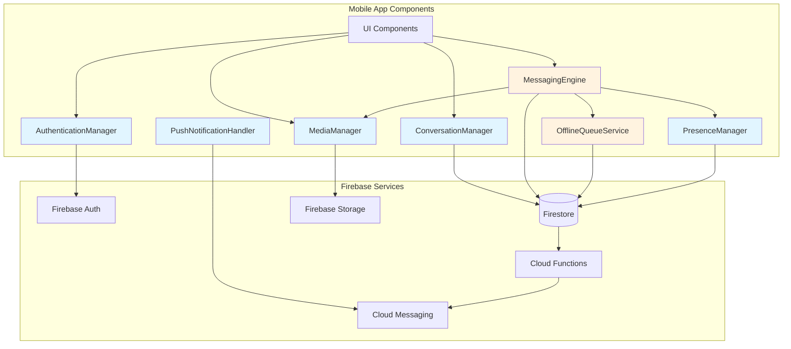

# Components

## AuthenticationManager

**Responsibility:** Manages user authentication state, login/signup flows, and auth persistence using Firebase Auth.

**Key Interfaces:**
- `signUp(email, password, displayName)` - Create new user account
- `signIn(email, password)` - Authenticate existing user
- `signOut()` - End user session
- `getCurrentUser()` - Get current auth state
- `onAuthStateChanged(callback)` - Listen to auth changes

**Dependencies:** Firebase Auth SDK, AsyncStorage (token persistence)

**Technology Stack:** Firebase Authentication, React Context (AuthContext)

## ConversationManager

**Responsibility:** Handles conversation list queries, conversation creation (one-on-one and groups), and real-time conversation updates.

**Key Interfaces:**
- `getUserConversations(userId)` - Query user's conversations with real-time listener
- `createOneOnOneConversation(userId, otherUserId)` - Create or get existing one-on-one chat
- `createGroupConversation(name, participantIds, photoURL?)` - Create group chat
- `updateLastMessage(conversationId, message)` - Update conversation metadata

**Dependencies:** Firestore SDK, ConversationModel

**Technology Stack:** Firestore queries with `onSnapshot`, React Context (ConversationsContext)

## MessagingEngine

**Responsibility:** Core messaging functionality including sending/receiving messages, optimistic UI updates, offline queue management, and delivery state tracking.

**Key Interfaces:**
- `sendTextMessage(conversationId, text)` - Send text message with optimistic UI
- `sendImageMessage(conversationId, imageUri)` - Upload and send image message
- `getMessages(conversationId)` - Query messages with real-time listener
- `updateMessageStatus(messageId, status)` - Update delivery/read status
- `processOfflineQueue()` - Send queued messages when online

**Dependencies:** Firestore SDK, Firebase Storage, AsyncStorage (offline queue), NetworkManager

**Technology Stack:** Firestore subcollections, optimistic updates pattern, message queue service

## OfflineQueueService

**Responsibility:** Manages offline message queue, retry logic with exponential backoff, and background sync when connectivity returns.

**Key Interfaces:**
- `enqueueMessage(message)` - Add message to offline queue
- `dequeueMessage(messageId)` - Remove from queue after successful send
- `processQueue()` - Attempt to send all queued messages
- `getQueuedMessages()` - Get list of pending messages

**Dependencies:** AsyncStorage, NetworkManager, Firestore SDK

**Technology Stack:** AsyncStorage for queue persistence, NetInfo for connectivity detection

## PresenceManager

**Responsibility:** Tracks and updates user online/offline status, manages presence listeners, and provides "last seen" functionality.

**Key Interfaces:**
- `setUserOnline(userId)` - Mark user as online
- `setUserOffline(userId)` - Mark user as offline with lastSeen timestamp
- `getUserPresence(userId)` - Get user's current presence with real-time listener
- `setupPresenceListeners()` - Configure Firebase disconnect handlers

**Dependencies:** Firestore SDK, Firebase Database (for onDisconnect triggers)

**Technology Stack:** Firestore documents with `onDisconnect()` handlers

## MediaManager

**Responsibility:** Handles image selection, compression, upload to Firebase Storage, and download/caching for display.

**Key Interfaces:**
- `pickImage(source: 'camera' | 'gallery')` - Select image from device
- `compressImage(imageUri, maxWidth)` - Client-side image compression
- `uploadImage(imageUri, path)` - Upload to Firebase Storage with progress
- `downloadImage(url)` - Download and cache image locally

**Dependencies:** expo-image-picker, Firebase Storage, AsyncStorage (image cache)

**Technology Stack:** Expo ImagePicker, Firebase Storage SDK, image compression library

## PushNotificationHandler

**Responsibility:** Manages FCM token registration, notification permissions, and foreground notification display.

**Key Interfaces:**
- `registerForNotifications()` - Request permissions and get FCM token
- `saveFCMToken(userId, token)` - Save token to Firestore for Cloud Function targeting
- `handleForegroundNotification(notification)` - Display in-app notification banner
- `navigateToConversation(notificationData)` - Handle notification tap navigation

**Dependencies:** expo-notifications, FCM, Firestore SDK

**Technology Stack:** Expo Notifications API, Firebase Cloud Messaging

## Component Diagram

