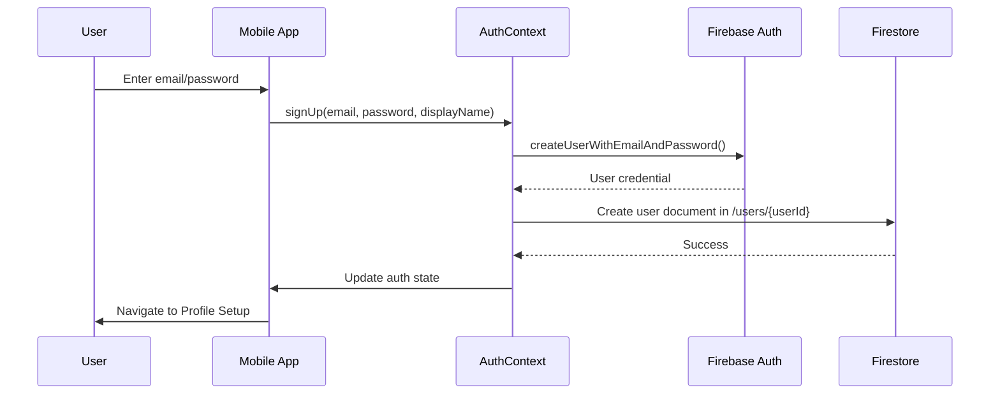
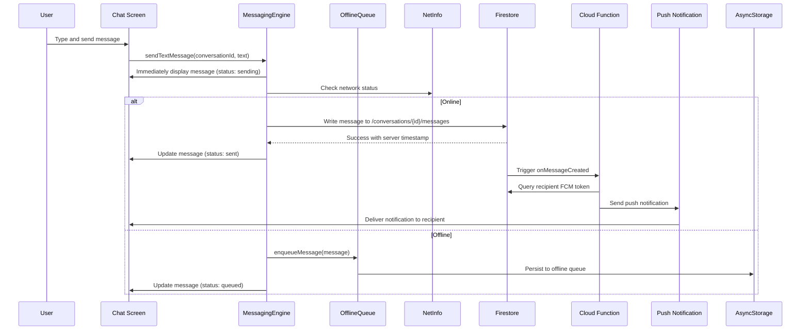
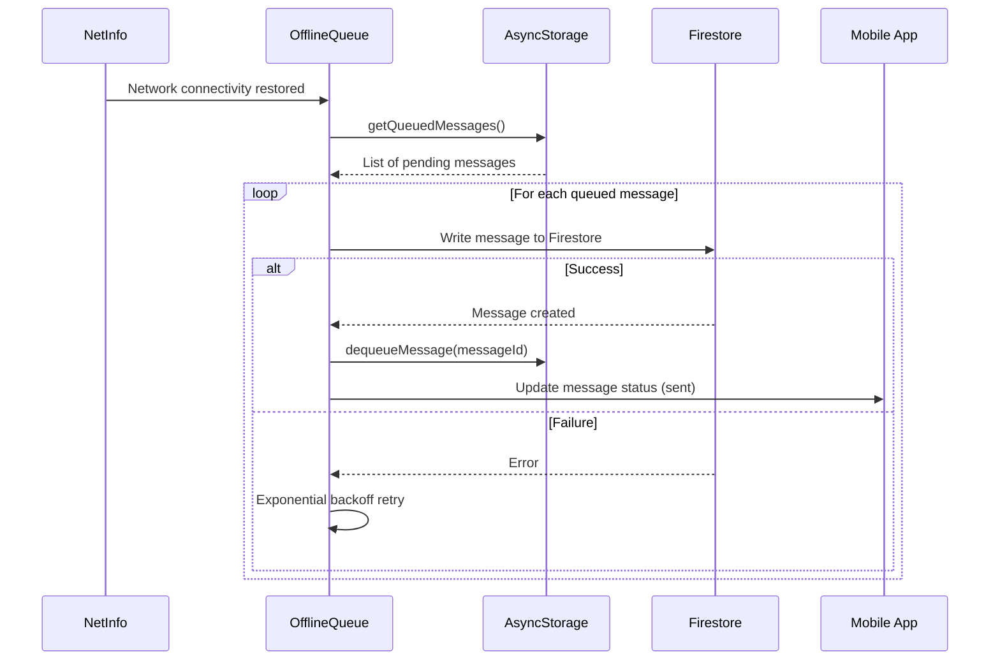

# Core Workflows

## User Authentication Flow

```mermaid
sequenceDiagram
    participant U as User
    participant UI as Mobile App
    participant AUTH as AuthContext
    participant FAUTH as Firebase Auth
    participant FS as Firestore

    U->>UI: Enter email/password
    UI->>AUTH: signUp(email, password, displayName)
    AUTH->>FAUTH: createUserWithEmailAndPassword()
    FAUTH-->>AUTH: User credential
    AUTH->>FS: Create user document in /users/{userId}
    FS-->>AUTH: Success
    AUTH->>UI: Update auth state
    UI->>U: Navigate to Profile Setup
```

## Send Message Workflow (with Optimistic UI)

```mermaid
sequenceDiagram
    participant U as User
    participant UI as Chat Screen
    participant MSG as MessagingEngine
    participant QUEUE as OfflineQueue
    participant NET as NetInfo
    participant FS as Firestore
    participant FUNC as Cloud Function
    participant FCM as Push Notification

    U->>UI: Type and send message
    UI->>MSG: sendTextMessage(conversationId, text)
    MSG->>UI: Immediately display message (status: sending)
    MSG->>NET: Check network status

    alt Online
        MSG->>FS: Write message to /conversations/{id}/messages
        FS-->>MSG: Success with server timestamp
        MSG->>UI: Update message (status: sent)
        FS->>FUNC: Trigger onMessageCreated
        FUNC->>FS: Query recipient FCM token
        FUNC->>FCM: Send push notification
        FCM->>UI: Deliver notification to recipient
    else Offline
        MSG->>QUEUE: enqueueMessage(message)
        QUEUE->>AsyncStorage: Persist to offline queue
        MSG->>UI: Update message (status: queued)
    end
```

## Offline Message Queue Processing

```mermaid
sequenceDiagram
    participant NET as NetInfo
    participant QUEUE as OfflineQueue
    participant AS as AsyncStorage
    participant FS as Firestore
    participant UI as Mobile App

    NET->>QUEUE: Network connectivity restored
    QUEUE->>AS: getQueuedMessages()
    AS-->>QUEUE: List of pending messages

    loop For each queued message
        QUEUE->>FS: Write message to Firestore
        alt Success
            FS-->>QUEUE: Message created
            QUEUE->>AS: dequeueMessage(messageId)
            QUEUE->>UI: Update message status (sent)
        else Failure
            FS-->>QUEUE: Error
            QUEUE->>QUEUE: Exponential backoff retry
        end
    end
```
