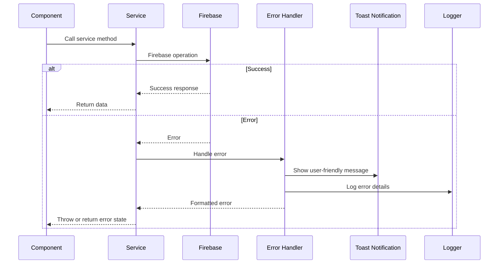

# Error Handling Strategy

## Error Flow Diagram



## Error Response Format

```typescript
export interface AppError {
  code: string;
  message: string;
  details?: Record<string, any>;
  timestamp: Date;
}

export const handleFirebaseError = (error: any): AppError => {
  const errorMap: Record<string, string> = {
    'auth/user-not-found': 'No account found with this email',
    'auth/wrong-password': 'Incorrect password',
    'auth/email-already-in-use': 'An account with this email already exists',
    'permission-denied': 'You do not have permission to perform this action',
    'not-found': 'The requested resource was not found',
  };

  return {
    code: error.code || 'unknown',
    message: errorMap[error.code] || 'An unexpected error occurred',
    details: error.details,
    timestamp: new Date(),
  };
};
```

## Frontend Error Handling

```typescript
// services/messageService.ts
export const sendTextMessage = async (
  conversationId: string,
  text: string
): Promise<void> => {
  try {
    // Attempt to send message
    await firestore()
      .collection('conversations')
      .doc(conversationId)
      .collection('messages')
      .add({
        type: 'text',
        text,
        senderId: auth().currentUser!.uid,
        timestamp: serverTimestamp(),
        status: 'sent',
      });
  } catch (error) {
    const appError = handleFirebaseError(error);

    // Log error
    console.error('[MessageService] Failed to send message:', appError);

    // Show toast notification
    Toast.show({
      type: 'error',
      text1: 'Failed to send message',
      text2: appError.message,
    });

    // Queue for retry if network error
    if (appError.code === 'unavailable') {
      await offlineQueueService.enqueueMessage({ conversationId, text });
    }

    throw appError;
  }
};
```
