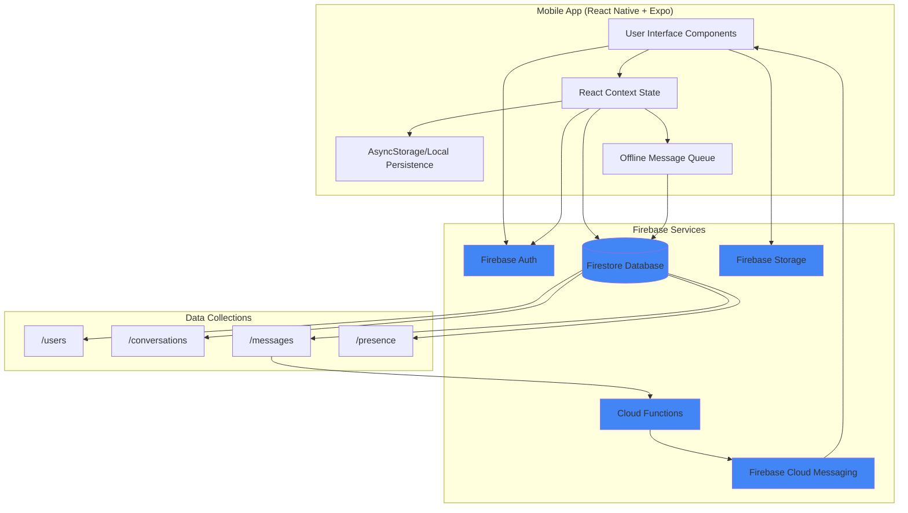

# High Level Architecture

## Technical Summary

MessageAI is a mobile-first messaging platform built on React Native with Expo and Firebase Backend-as-a-Service. The architecture employs a serverless pattern where the mobile app communicates directly with Firebase services (Firestore, Auth, Storage, FCM) for all backend operations, eliminating the need for custom API servers. Real-time message synchronization is achieved through Firestore's native listeners, while offline capabilities are implemented via local persistence with AsyncStorage and an optimistic UI pattern with message queueing. Cloud Functions are used minimally for push notifications only. This architecture prioritizes rapid MVP development, automatic scaling via Firebase, and WhatsApp-level reliability through proven Firebase infrastructure combined with carefully designed offline-first mobile patterns.

## Platform and Infrastructure Choice

**Platform:** Firebase (Google Cloud Platform)

**Key Services:**
- Firestore (real-time NoSQL database)
- Firebase Authentication (user auth with email/password)
- Firebase Storage (image storage)
- Firebase Cloud Functions (serverless push notification triggers)
- Firebase Cloud Messaging (FCM for push notifications)
- Firebase Hosting (future web version deployment)

**Mobile Platform:** React Native with Expo (iOS for MVP, Android-ready architecture)

**Deployment Host and Regions:**
- Firebase: Multi-region (us-central1 for Cloud Functions, automatic global distribution for Firestore/Storage)
- Expo: Development builds via Expo Go, future production via EAS Build

## Repository Structure

**Structure:** Monorepo

**Monorepo Tool:** npm workspaces (lightweight, no additional tooling needed)

**Package Organization:**
```
/mobile          - React Native app (Expo managed workflow)
/functions       - Firebase Cloud Functions (TypeScript)
/shared          - Shared TypeScript types and constants
```

**Rationale:** Monorepo enables shared TypeScript interfaces between mobile app and Cloud Functions, atomic commits for features spanning client and backend, and simplified developer workflow. npm workspaces chosen over Turborepo/Nx for simplicity given small project scope.

## High Level Architecture Diagram



## Architectural Patterns

- **Serverless Backend-as-a-Service (BaaS):** Firebase provides all backend infrastructure without custom servers - _Rationale:_ Eliminates infrastructure management, automatic scaling, and built-in real-time sync capabilities perfect for messaging apps.

- **Direct Client-to-Firebase Integration:** Mobile app communicates directly with Firebase services via SDK - _Rationale:_ Reduces latency, simplifies architecture, leverages Firebase's optimized client libraries for offline support.

- **Offline-First Mobile Architecture:** Local persistence with optimistic UI updates and background sync - _Rationale:_ Critical for messaging reliability per PRD requirements (FR10, FR12, FR13, FR14).

- **Real-Time Data Synchronization:** Firestore listeners (`onSnapshot`) for live message updates - _Rationale:_ Provides WhatsApp-level instant messaging experience without polling or custom WebSocket infrastructure.

- **Component-Based UI (React Native):** Reusable functional components with React hooks - _Rationale:_ Modern React patterns, excellent developer experience, strong TypeScript support.

- **Repository Pattern for Offline Queue:** Abstract message queue management behind service layer - _Rationale:_ Encapsulates complex retry logic, enables testing, isolates Firebase dependencies.

- **Event-Driven Push Notifications:** Cloud Functions trigger on Firestore document creation - _Rationale:_ Decouples notification logic from mobile app, leverages Firebase's automatic function invocation.
